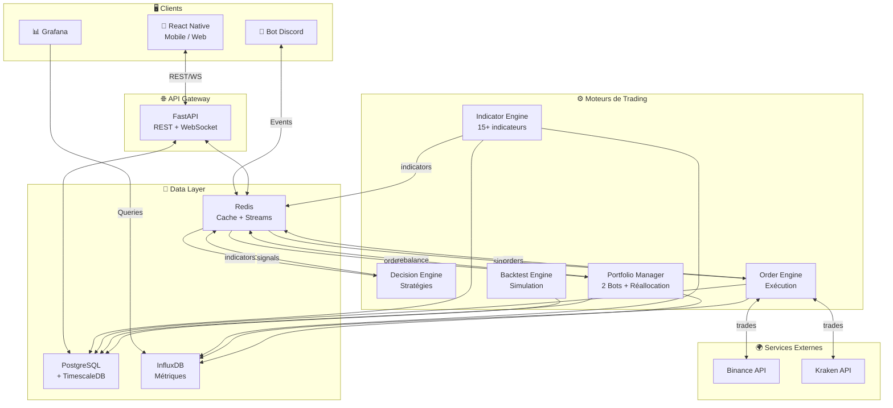
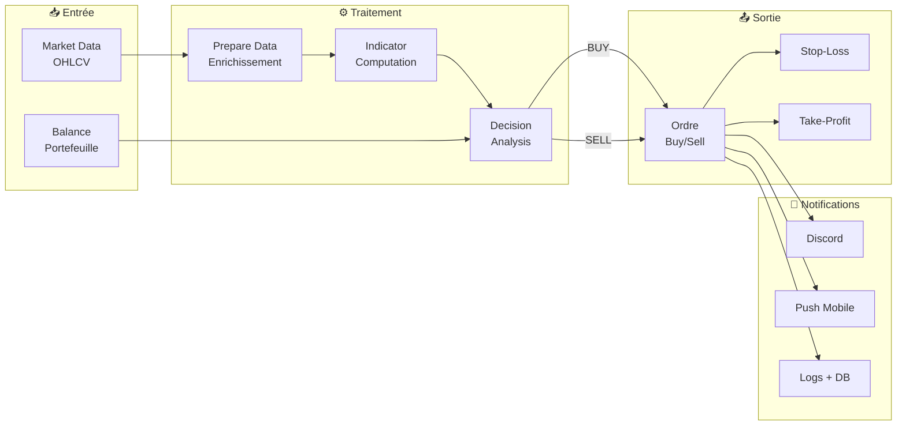
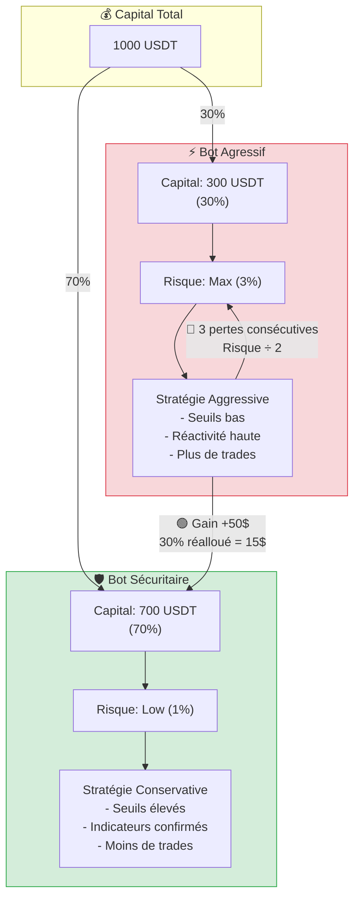
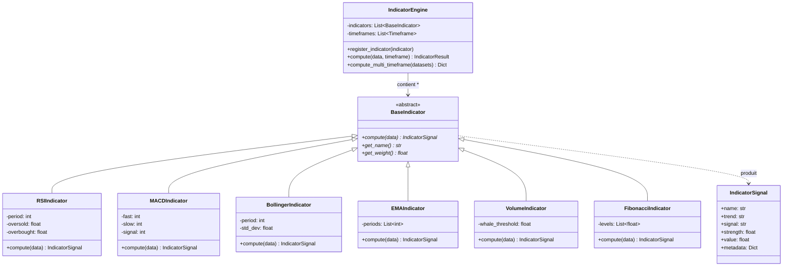
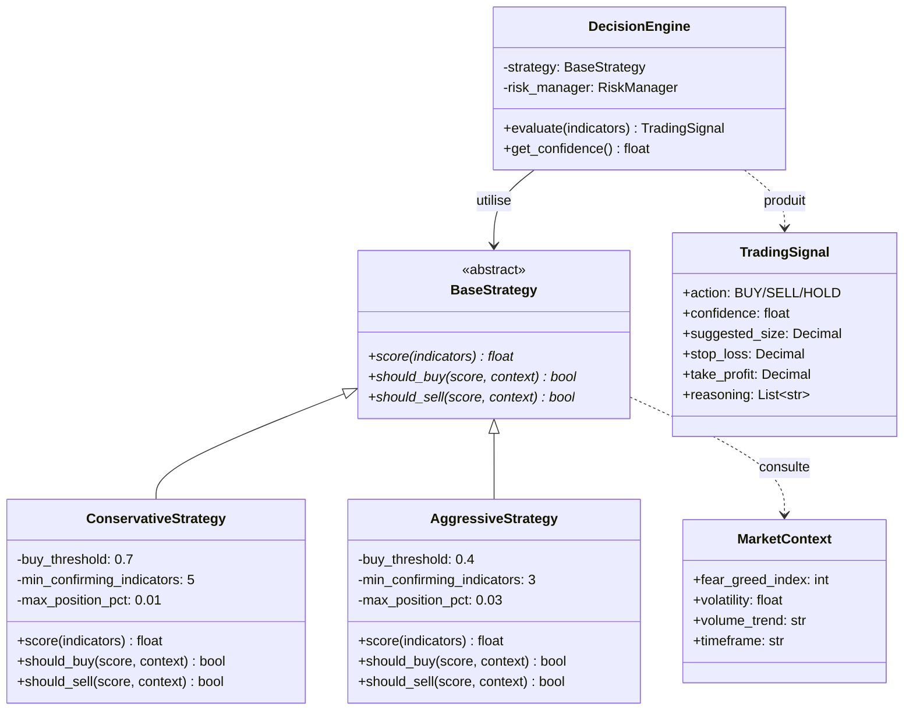
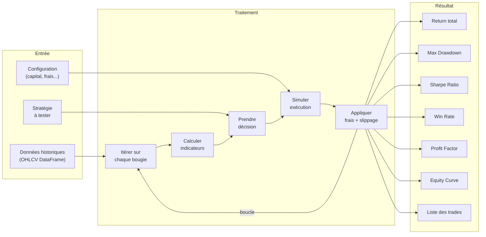
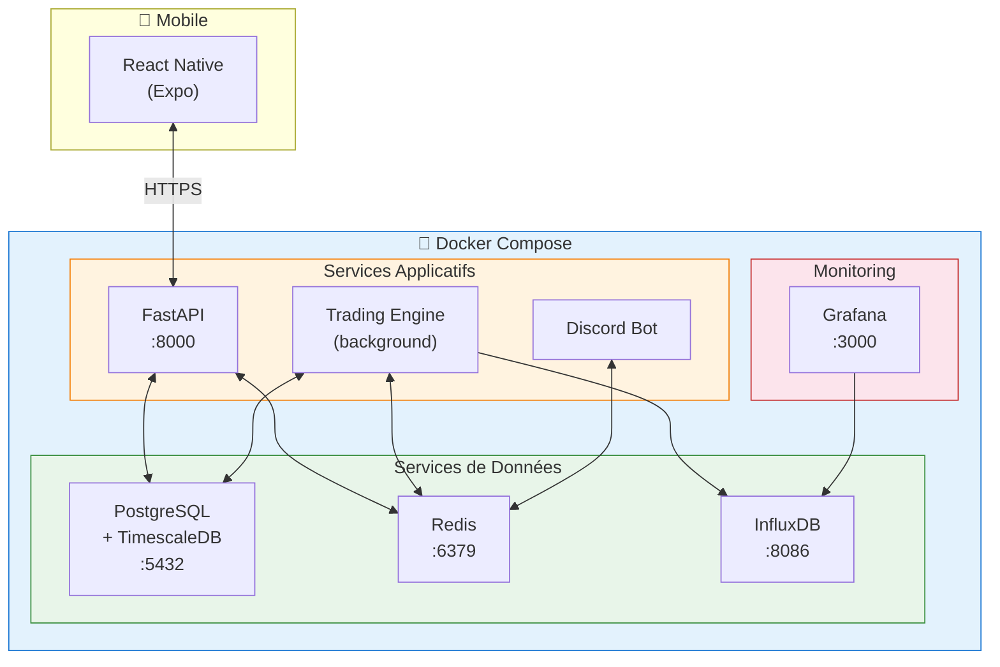
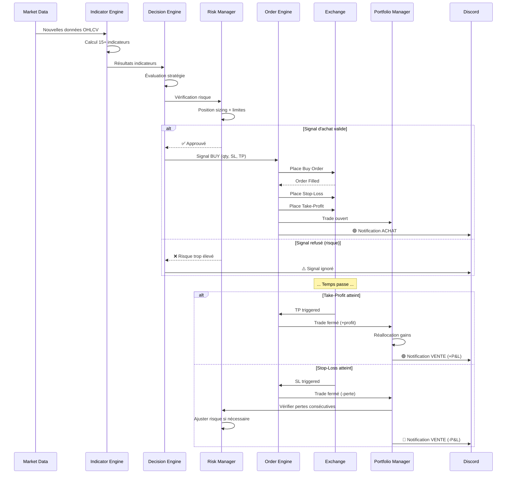
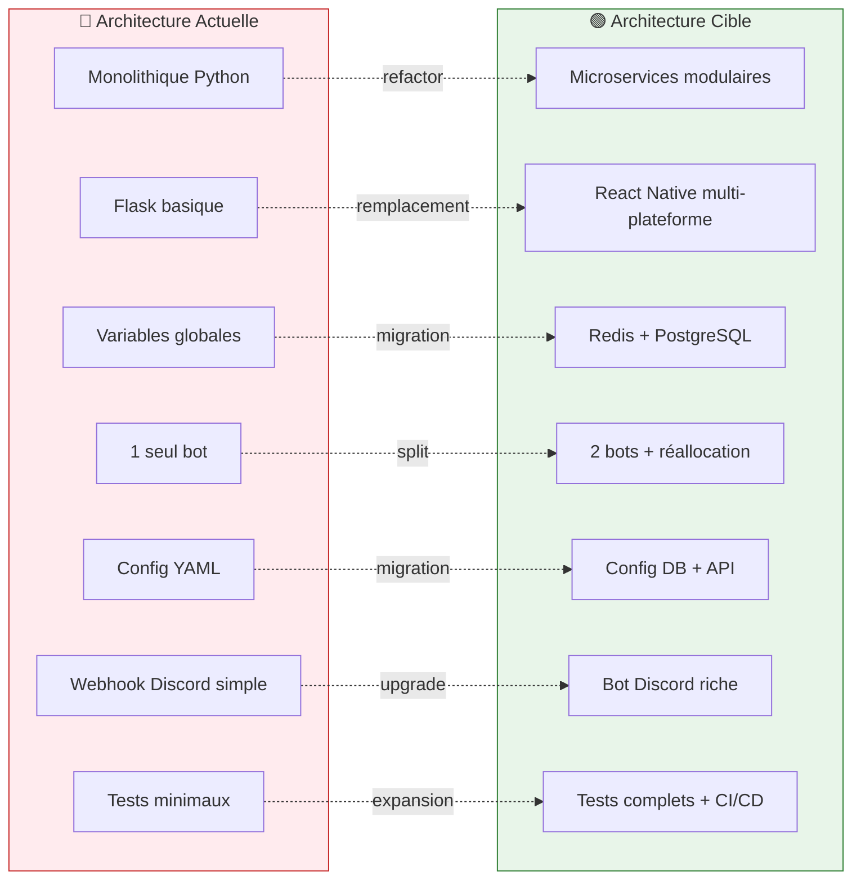

# CryptoTrader Bot — Schémas & Diagrammes

> Les diagrammes utilisent la syntaxe **Mermaid** (rendu natif sur GitHub, GitLab, etc.)

---

## 1. Architecture globale (Vue de haut niveau)

---

## 2. Flux de données (Pipeline de trading)

---

## 3. Système de bots (Sécuritaire + Agressif)

---

## 4. Moteur d'indicateurs (Pattern Plugin)

---

## 5. Moteur de décision (Pattern Strategy)

---

## 6. Gestion des risques & Réallocation

```mermaid
flowchart TD
    subgraph TradeResult["Résultat d'un Trade"]
        WIN["🟢 Trade Gagnant"]
        LOSS["🔴 Trade Perdant"]
    end

    subgraph RiskEval["Évaluation du Risque"]
        CHECK["Vérifier historique<br/>des trades"]
        CONSEC["Pertes consécutives?"]
    end

    subgraph Actions["Actions"]
        REALLOC["Réallocation<br/>% gains → Bot Safe"]
        REDUCE["Réduire risque<br/>ratio ÷ 2"]
        PAUSE["⏸️ Pause trading<br/>(5+ pertes)"]
        RESTORE["Restaurer risque<br/>(2 gains consécutifs)"]
    end

    WIN --> CHECK
    LOSS --> CHECK
    CHECK --> CONSEC

    CONSEC -->|"≥ 3 pertes"| REDUCE
    CONSEC -->|"≥ 5 pertes"| PAUSE
    CONSEC -->|"< 3 pertes"| RESTORE
    WIN -->|"Bot Agressif"| REALLOC

    REALLOC -->|"30% des gains"| SAFE["🛡️ Bot Sécuritaire<br/>+capital"]
    REDUCE -->|"Max→Mid ou Mid→Low"| RISK["📉 Risque réduit"]
    RESTORE -->|"Progressif"| RISKRESTORE["📈 Risque restauré"]

    style WIN fill:#d4edda,stroke:#28a745
    style LOSS fill:#f8d7da,stroke:#dc3545
    style PAUSE fill:#fff3cd,stroke:#ffc107
```

---

## 7. Backtest Engine (Flux)

---

## 8. Infrastructure de déploiement

---

## 9. Séquence d'un trade (Achat → Vente)

---

## 10. Comparaison existant vs cible

