# CryptoTrader Bot — Schémas & Diagrammes

> Les diagrammes utilisent la syntaxe **Mermaid** (rendu natif sur GitHub, GitLab, etc.)

---

## 1. Architecture globale (Vue de haut niveau)

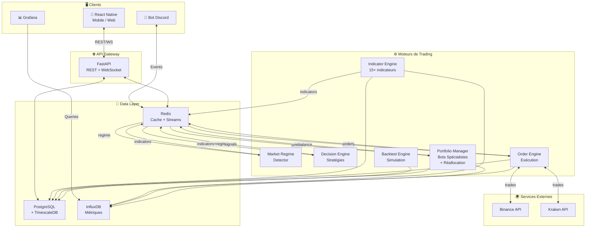

---

## 2. Flux de données (Pipeline de trading)

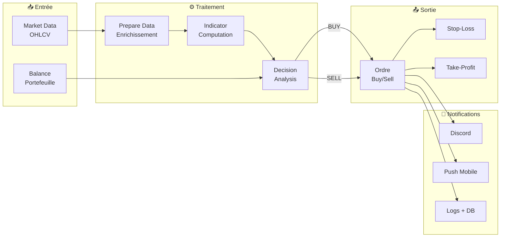

---

## 3. Système complet de bots (Spécialistes + Profils de risque)

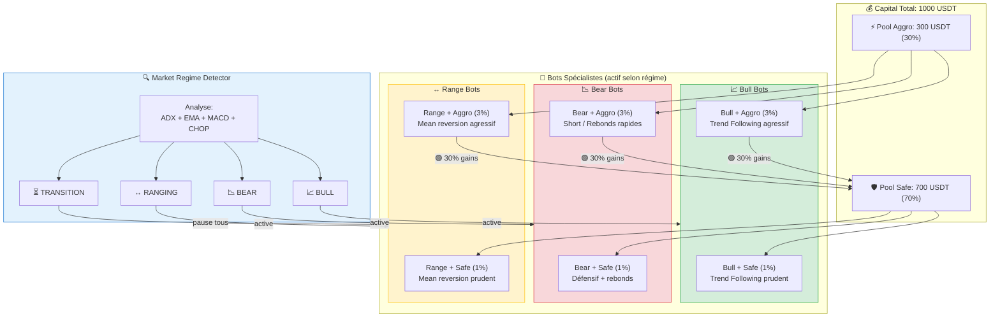

---

## 4. Moteur d'indicateurs (Pattern Plugin)

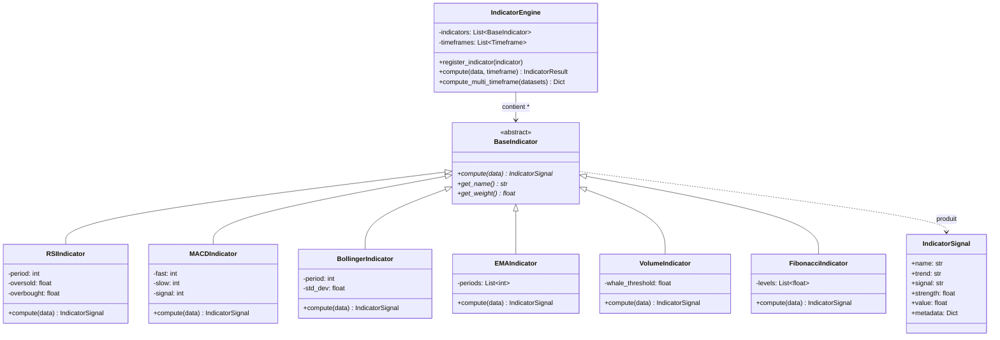

---

## 5. Moteur de décision (Pattern Strategy) + Bots spécialistes

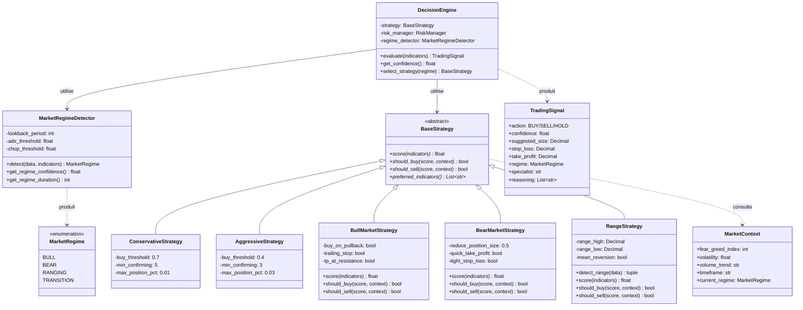

**Note** : Les stratégies `Conservative` / `Aggressive` sont des **profils de risque** (taille de position, seuils). Les stratégies `Bull` / `Bear` / `Range` sont des **spécialistes de marché** (logique d'entrée/sortie). Un bot combine les deux : par ex. `BullMarketStrategy` + `AggressiveStrategy` = Bull Bot Agressif.

---

## 6. Gestion des risques & Réallocation

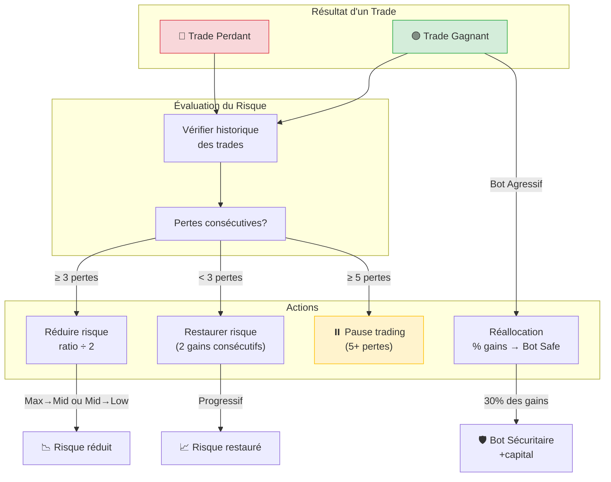

---

## 7. Backtest Engine (Flux)

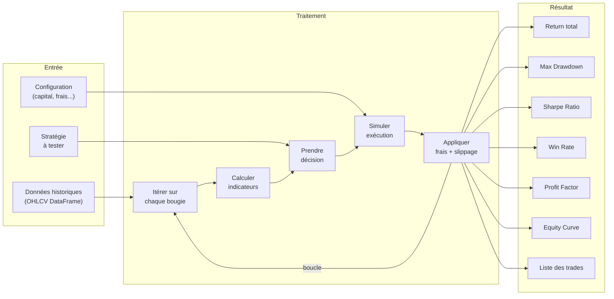

---

## 8. Infrastructure de déploiement

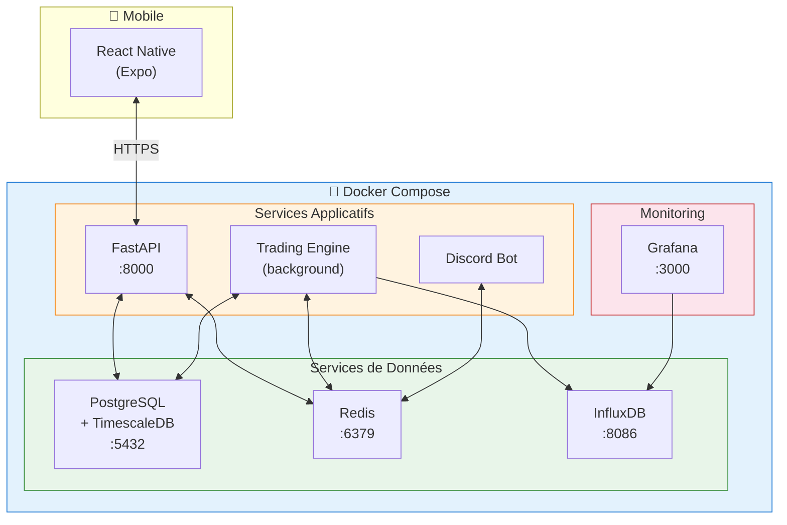

---

## 9. Séquence d'un trade (Achat → Vente)

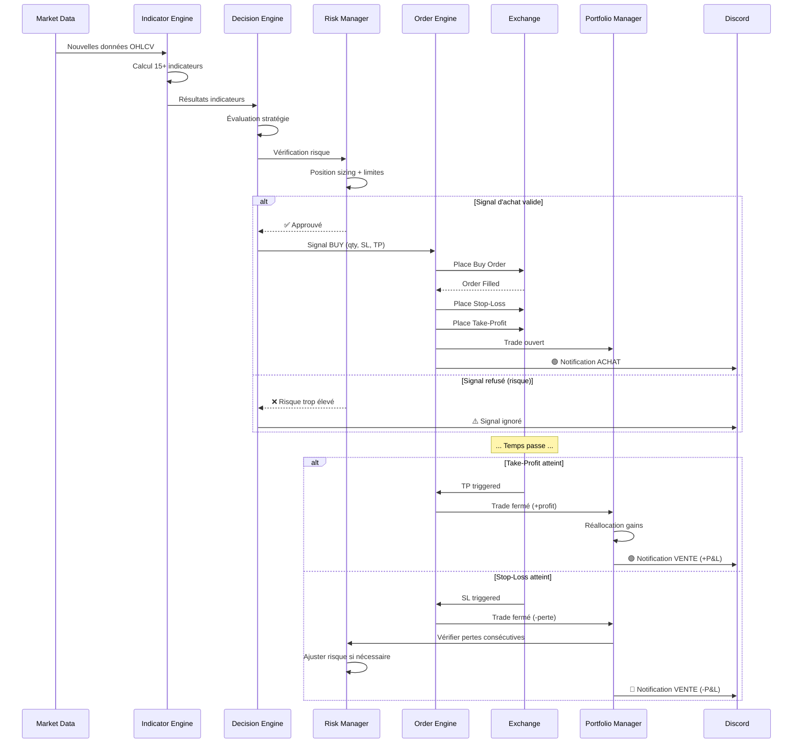

---

## 10. Détection de régime & Activation des bots spécialistes

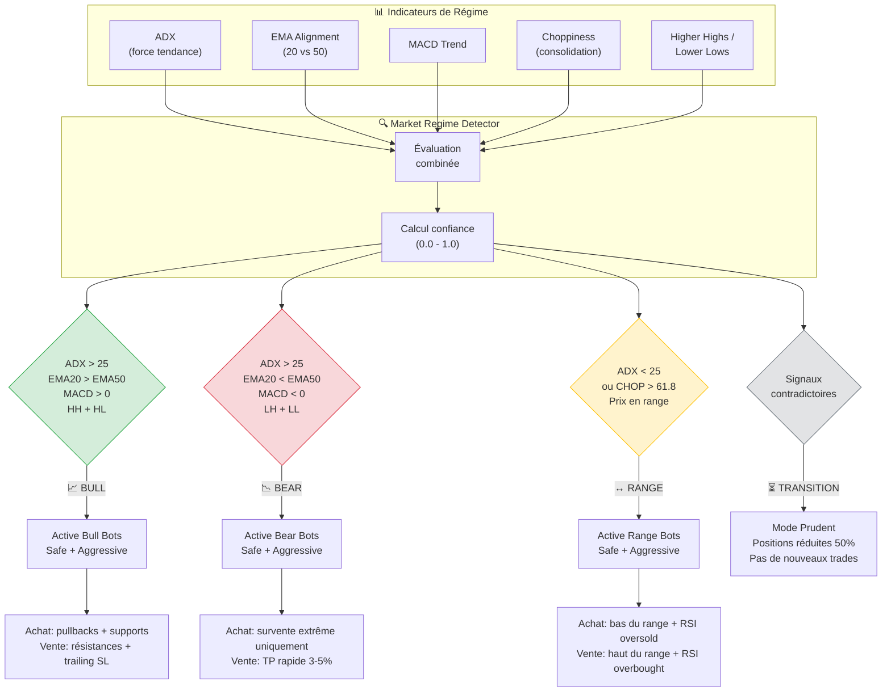

---

## 11. Séquence de changement de régime

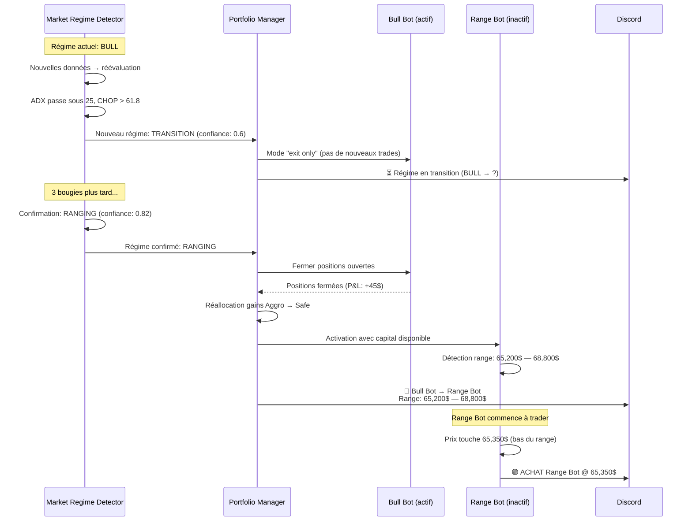

---

## 12. Comparaison existant vs cible

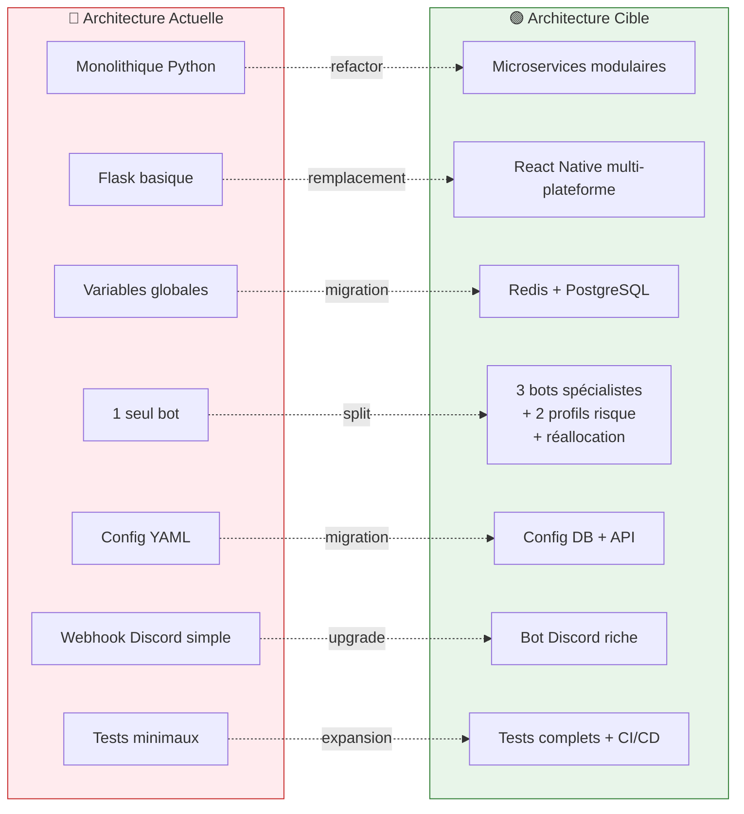
