# CryptoTrader Bot — Schémas & Diagrammes

> Les diagrammes utilisent la syntaxe **Mermaid** (rendu natif sur GitHub, GitLab, etc.)

---

## 1. Architecture globale (Vue de haut niveau)

```mermaid
graph TB
    subgraph Clients["🖥️ Clients"]
        RN["📱 React Native<br/>Mobile / Web"]
        DC["🤖 Bot Discord"]
        GF["📊 Grafana"]
    end

    subgraph API["🌐 API Gateway"]
        FA["FastAPI<br/>REST + WebSocket"]
    end

    subgraph Engines["⚙️ Moteurs de Trading"]
        IE["Indicator Engine<br/>15+ indicateurs"]
        DE["Decision Engine<br/>Stratégies"]
        OE["Order Engine<br/>Exécution"]
        PM["Portfolio Manager<br/>2 Bots + Réallocation"]
        BE["Backtest Engine<br/>Simulation"]
    end

    subgraph Data["💾 Data Layer"]
        PG["PostgreSQL<br/>+ TimescaleDB"]
        RD["Redis<br/>Cache + Streams"]
        IF["InfluxDB<br/>Métriques"]
    end

    subgraph External["🌍 Services Externes"]
        BN["Binance API"]
        KR["Kraken API"]
    end

    RN <-->|REST/WS| FA
    DC <-->|Events| RD
    GF -->|Queries| IF

    FA <--> RD
    FA <--> PG

    IE -->|indicators| RD
    RD -->|indicators| DE
    DE -->|signals| RD
    RD -->|signals| OE
    OE -->|orders| RD
    RD -->|orders| PM
    PM -->|rebalance| RD

    OE <-->|trades| BN
    OE <-->|trades| KR

    IE --> PG
    OE --> PG
    PM --> PG
    BE --> PG

    IE --> IF
    OE --> IF
    PM --> IF
```

---

## 2. Flux de données (Pipeline de trading)

```mermaid
flowchart LR
    subgraph Input["📥 Entrée"]
        MK["Market Data<br/>OHLCV"]
        BL["Balance<br/>Portefeuille"]
    end

    subgraph Processing["⚙️ Traitement"]
        PD["Prepare Data<br/>Enrichissement"]
        IC["Indicator<br/>Computation"]
        DA["Decision<br/>Analysis"]
    end

    subgraph Output["📤 Sortie"]
        ORD["Ordre<br/>Buy/Sell"]
        SL["Stop-Loss"]
        TP["Take-Profit"]
    end

    subgraph Notifications["🔔 Notifications"]
        DSC["Discord"]
        PSH["Push Mobile"]
        LOG["Logs + DB"]
    end

    MK --> PD --> IC --> DA
    BL --> DA
    DA -->|BUY| ORD
    DA -->|SELL| ORD
    ORD --> SL
    ORD --> TP
    ORD --> DSC
    ORD --> PSH
    ORD --> LOG
```

---

## 3. Système de bots (Sécuritaire + Agressif)

```mermaid
flowchart TB
    subgraph Capital["💰 Capital Total"]
        TC["1000 USDT"]
    end

    subgraph SafeBot["🛡️ Bot Sécuritaire"]
        SB_CAP["Capital: 700 USDT<br/>(70%)"]
        SB_RISK["Risque: Low (1%)"]
        SB_STRAT["Stratégie Conservative<br/>- Seuils élevés<br/>- Indicateurs confirmés<br/>- Moins de trades"]
    end

    subgraph AggroBot["⚡ Bot Agressif"]
        AB_CAP["Capital: 300 USDT<br/>(30%)"]
        AB_RISK["Risque: Max (3%)"]
        AB_STRAT["Stratégie Aggressive<br/>- Seuils bas<br/>- Réactivité haute<br/>- Plus de trades"]
    end

    TC -->|70%| SB_CAP
    TC -->|30%| AB_CAP

    SB_CAP --> SB_RISK --> SB_STRAT
    AB_CAP --> AB_RISK --> AB_STRAT

    AB_STRAT -->|"🟢 Gain +50$<br/>30% réalloué = 15$"| SB_CAP
    AB_STRAT -->|"🔴 3 pertes consécutives<br/>Risque ÷ 2"| AB_RISK

    style SafeBot fill:#d4edda,stroke:#28a745
    style AggroBot fill:#f8d7da,stroke:#dc3545
```

---

## 4. Moteur d'indicateurs (Pattern Plugin)

---

## 5. Moteur de décision (Pattern Strategy)

---

## 6. Gestion des risques & Réallocation

```mermaid
flowchart TD
    subgraph TradeResult["Résultat d'un Trade"]
        WIN["🟢 Trade Gagnant"]
        LOSS["🔴 Trade Perdant"]
    end

    subgraph RiskEval["Évaluation du Risque"]
        CHECK["Vérifier historique<br/>des trades"]
        CONSEC["Pertes consécutives?"]
    end

    subgraph Actions["Actions"]
        REALLOC["Réallocation<br/>% gains → Bot Safe"]
        REDUCE["Réduire risque<br/>ratio ÷ 2"]
        PAUSE["⏸️ Pause trading<br/>(5+ pertes)"]
        RESTORE["Restaurer risque<br/>(2 gains consécutifs)"]
    end

    WIN --> CHECK
    LOSS --> CHECK
    CHECK --> CONSEC

    CONSEC -->|"≥ 3 pertes"| REDUCE
    CONSEC -->|"≥ 5 pertes"| PAUSE
    CONSEC -->|"< 3 pertes"| RESTORE
    WIN -->|"Bot Agressif"| REALLOC

    REALLOC -->|"30% des gains"| SAFE["🛡️ Bot Sécuritaire<br/>+capital"]
    REDUCE -->|"Max→Mid ou Mid→Low"| RISK["📉 Risque réduit"]
    RESTORE -->|"Progressif"| RISKRESTORE["📈 Risque restauré"]

    style WIN fill:#d4edda,stroke:#28a745
    style LOSS fill:#f8d7da,stroke:#dc3545
    style PAUSE fill:#fff3cd,stroke:#ffc107
```

---

## 7. Backtest Engine (Flux)

```mermaid
flowchart LR
    subgraph Input["Entrée"]
        HD["Données historiques<br/>(OHLCV DataFrame)"]
        ST["Stratégie<br/>à tester"]
        CF["Configuration<br/>(capital, frais...)"]
    end

    subgraph Process["Traitement"]
        ITER["Itérer sur<br/>chaque bougie"]
        CALC["Calculer<br/>indicateurs"]
        DEC["Prendre<br/>décision"]
        SIM["Simuler<br/>exécution"]
        FEE["Appliquer<br/>frais + slippage"]
    end

    subgraph Output["Résultat"]
        RET["Return total"]
        DD["Max Drawdown"]
        SR["Sharpe Ratio"]
        WR["Win Rate"]
        PF["Profit Factor"]
        EC["Equity Curve"]
        TL["Liste des trades"]
    end

    HD --> ITER
    ST --> DEC
    CF --> SIM

    ITER --> CALC --> DEC --> SIM --> FEE
    FEE -->|"boucle"| ITER

    FEE --> RET
    FEE --> DD
    FEE --> SR
    FEE --> WR
    FEE --> PF
    FEE --> EC
    FEE --> TL
```

---

## 8. Infrastructure de déploiement

```mermaid
graph TB
    subgraph Docker["🐳 Docker Compose"]
        subgraph Services["Services Applicatifs"]
            API["FastAPI<br/>:8000"]
            TE["Trading Engine<br/>(background)"]
            DB_BOT["Discord Bot"]
        end

        subgraph DataServices["Services de Données"]
            PG["PostgreSQL<br/>+ TimescaleDB<br/>:5432"]
            RD["Redis<br/>:6379"]
            IF["InfluxDB<br/>:8086"]
        end

        subgraph Monitoring["Monitoring"]
            GF["Grafana<br/>:3000"]
        end
    end

    subgraph Mobile["📱 Mobile"]
        EXPO["React Native<br/>(Expo)"]
    end

    API <--> PG
    API <--> RD
    TE <--> PG
    TE <--> RD
    TE --> IF
    DB_BOT <--> RD
    GF --> IF

    EXPO <-->|"HTTPS"| API

    style Docker fill:#e3f2fd,stroke:#1976d2
    style Services fill:#fff3e0,stroke:#f57c00
    style DataServices fill:#e8f5e9,stroke:#388e3c
    style Monitoring fill:#fce4ec,stroke:#c62828
```

---

## 9. Séquence d'un trade (Achat → Vente)

```mermaid
sequenceDiagram
    participant MK as Market Data
    participant IE as Indicator Engine
    participant DE as Decision Engine
    participant RM as Risk Manager
    participant OE as Order Engine
    participant EX as Exchange
    participant PM as Portfolio Manager
    participant DC as Discord

    MK->>IE: Nouvelles données OHLCV
    IE->>IE: Calcul 15+ indicateurs
    IE->>DE: Résultats indicateurs

    DE->>DE: Évaluation stratégie
    DE->>RM: Vérification risque
    RM->>RM: Position sizing + limites

    alt Signal d'achat valide
        RM-->>DE: ✅ Approuvé
        DE->>OE: Signal BUY (qty, SL, TP)
        OE->>EX: Place Buy Order
        EX-->>OE: Order Filled
        OE->>EX: Place Stop-Loss
        OE->>EX: Place Take-Profit
        OE->>PM: Trade ouvert
        OE->>DC: 🟢 Notification ACHAT
    else Signal refusé (risque)
        RM-->>DE: ❌ Risque trop élevé
        DE->>DC: ⚠️ Signal ignoré
    end

    Note over EX: ... Temps passe ...

    alt Take-Profit atteint
        EX->>OE: TP triggered
        OE->>PM: Trade fermé (+profit)
        PM->>PM: Réallocation gains
        PM->>DC: 🟢 Notification VENTE (+P&L)
    else Stop-Loss atteint
        EX->>OE: SL triggered
        OE->>PM: Trade fermé (-perte)
        PM->>RM: Vérifier pertes consécutives
        RM->>RM: Ajuster risque si nécessaire
        PM->>DC: 🔴 Notification VENTE (-P&L)
    end
```

---

## 10. Comparaison existant vs cible

```mermaid
graph LR
    subgraph Current["🔴 Architecture Actuelle"]
        direction TB
        C1["Monolithique Python"]
        C2["Flask basique"]
        C3["Variables globales"]
        C4["1 seul bot"]
        C5["Config YAML"]
        C6["Webhook Discord simple"]
        C7["Tests minimaux"]
    end

    subgraph Target["🟢 Architecture Cible"]
        direction TB
        T1["Microservices modulaires"]
        T2["React Native multi-plateforme"]
        T3["Redis + PostgreSQL"]
        T4["2 bots + réallocation"]
        T5["Config DB + API"]
        T6["Bot Discord riche"]
        T7["Tests complets + CI/CD"]
    end

    C1 -.->|"refactor"| T1
    C2 -.->|"remplacement"| T2
    C3 -.->|"migration"| T3
    C4 -.->|"split"| T4
    C5 -.->|"migration"| T5
    C6 -.->|"upgrade"| T6
    C7 -.->|"expansion"| T7

    style Current fill:#ffebee,stroke:#c62828
    style Target fill:#e8f5e9,stroke:#2e7d32
```

