# CryptoTrader Bot — Schémas & Diagrammes

> Les diagrammes utilisent la syntaxe **Mermaid** (rendu natif sur GitHub, GitLab, etc.)

---

## 1. Architecture globale (Vue de haut niveau)

```mermaid
graph TB
    subgraph Clients["🖥️ Clients"]
        RN["📱 React Native<br/>Mobile / Web"]
        DC["🤖 Bot Discord"]
        GF["📊 Grafana"]
    end

    subgraph API["🌐 API Gateway"]
        FA["FastAPI<br/>REST + WebSocket"]
    end

    subgraph Engines["⚙️ Moteurs de Trading"]
        IE["Indicator Engine<br/>15+ indicateurs"]
        MRD["Market Regime<br/>Detector"]
        DE["Decision Engine<br/>Stratégies"]
        OE["Order Engine<br/>Exécution"]
        PM["Portfolio Manager<br/>Bots Spécialistes<br/>+ Réallocation"]
        BE["Backtest Engine<br/>Simulation"]
    end

    subgraph Data["💾 Data Layer"]
        PG["PostgreSQL<br/>+ TimescaleDB"]
        RD["Redis<br/>Cache + Streams"]
        IF["InfluxDB<br/>Métriques"]
    end

    subgraph External["🌍 Services Externes"]
        BN["Binance API"]
        KR["Kraken API"]
    end

    RN <-->|REST/WS| FA
    DC <-->|Events| RD
    GF -->|Queries| IF

    FA <--> RD
    FA <--> PG

    IE -->|indicators| RD
    RD -->|indicators| MRD
    MRD -->|regime| RD
    RD -->|indicators+regime| DE
    DE -->|signals| RD
    RD -->|signals| OE
    OE -->|orders| RD
    RD -->|orders| PM
    PM -->|rebalance| RD

    OE <-->|trades| BN
    OE <-->|trades| KR

    IE --> PG
    OE --> PG
    PM --> PG
    BE --> PG

    IE --> IF
    OE --> IF
    PM --> IF
```

---

## 2. Flux de données (Pipeline de trading)

```mermaid
flowchart LR
    subgraph Input["📥 Entrée"]
        MK["Market Data<br/>OHLCV"]
        BL["Balance<br/>Portefeuille"]
    end

    subgraph Processing["⚙️ Traitement"]
        PD["Prepare Data<br/>Enrichissement"]
        IC["Indicator<br/>Computation"]
        DA["Decision<br/>Analysis"]
    end

    subgraph Output["📤 Sortie"]
        ORD["Ordre<br/>Buy/Sell"]
        SL["Stop-Loss"]
        TP["Take-Profit"]
    end

    subgraph Notifications["🔔 Notifications"]
        DSC["Discord"]
        PSH["Push Mobile"]
        LOG["Logs + DB"]
    end

    MK --> PD --> IC --> DA
    BL --> DA
    DA -->|BUY| ORD
    DA -->|SELL| ORD
    ORD --> SL
    ORD --> TP
    ORD --> DSC
    ORD --> PSH
    ORD --> LOG
```

---

## 3. Système complet de bots (Spécialistes + Profils de risque)

```mermaid
flowchart TB
    subgraph Capital["💰 Capital Total: 1000 USDT"]
        SAFE_POOL["🛡️ Pool Safe: 700 USDT (70%)"]
        AGGRO_POOL["⚡ Pool Aggro: 300 USDT (30%)"]
    end

    subgraph Detection["🔍 Market Regime Detector"]
        MRD["Analyse:<br/>ADX + EMA + MACD + CHOP"]
        BULL_D["📈 BULL"]
        BEAR_D["📉 BEAR"]
        RANGE_D["↔️ RANGING"]
        TRANS_D["⏳ TRANSITION"]
    end

    subgraph Specialists["🤖 Bots Spécialistes (actif selon régime)"]
        subgraph BullBots["📈 Bull Bots"]
            BULL_SAFE["Bull + Safe (1%)<br/>Trend Following prudent"]
            BULL_AGGRO["Bull + Aggro (3%)<br/>Trend Following agressif"]
        end
        subgraph BearBots["📉 Bear Bots"]
            BEAR_SAFE["Bear + Safe (1%)<br/>Défensif + rebonds"]
            BEAR_AGGRO["Bear + Aggro (3%)<br/>Short / Rebonds rapides"]
        end
        subgraph RangeBots["↔️ Range Bots"]
            RANGE_SAFE["Range + Safe (1%)<br/>Mean reversion prudent"]
            RANGE_AGGRO["Range + Aggro (3%)<br/>Mean reversion agressif"]
        end
    end

    MRD --> BULL_D
    MRD --> BEAR_D
    MRD --> RANGE_D
    MRD --> TRANS_D

    BULL_D -->|"active"| BullBots
    BEAR_D -->|"active"| BearBots
    RANGE_D -->|"active"| RangeBots
    TRANS_D -->|"pause tous"| Specialists

    SAFE_POOL --> BULL_SAFE
    SAFE_POOL --> BEAR_SAFE
    SAFE_POOL --> RANGE_SAFE
    AGGRO_POOL --> BULL_AGGRO
    AGGRO_POOL --> BEAR_AGGRO
    AGGRO_POOL --> RANGE_AGGRO

    BULL_AGGRO -->|"🟢 30% gains"| SAFE_POOL
    BEAR_AGGRO -->|"🟢 30% gains"| SAFE_POOL
    RANGE_AGGRO -->|"🟢 30% gains"| SAFE_POOL

    style BullBots fill:#d4edda,stroke:#28a745
    style BearBots fill:#f8d7da,stroke:#dc3545
    style RangeBots fill:#fff3cd,stroke:#ffc107
    style Detection fill:#e3f2fd,stroke:#1976d2
```

---

## 4. Moteur d'indicateurs (Pattern Plugin)

---

## 5. Moteur de décision (Pattern Strategy) + Bots spécialistes

**Note** : Les stratégies `Conservative` / `Aggressive` sont des **profils de risque** (taille de position, seuils). Les stratégies `Bull` / `Bear` / `Range` sont des **spécialistes de marché** (logique d'entrée/sortie). Un bot combine les deux : par ex. `BullMarketStrategy` + `AggressiveStrategy` = Bull Bot Agressif.

---

## 6. Gestion des risques & Réallocation

```mermaid
flowchart TD
    subgraph TradeResult["Résultat d'un Trade"]
        WIN["🟢 Trade Gagnant"]
        LOSS["🔴 Trade Perdant"]
    end

    subgraph RiskEval["Évaluation du Risque"]
        CHECK["Vérifier historique<br/>des trades"]
        CONSEC["Pertes consécutives?"]
    end

    subgraph Actions["Actions"]
        REALLOC["Réallocation<br/>% gains → Bot Safe"]
        REDUCE["Réduire risque<br/>ratio ÷ 2"]
        PAUSE["⏸️ Pause trading<br/>(5+ pertes)"]
        RESTORE["Restaurer risque<br/>(2 gains consécutifs)"]
    end

    WIN --> CHECK
    LOSS --> CHECK
    CHECK --> CONSEC

    CONSEC -->|"≥ 3 pertes"| REDUCE
    CONSEC -->|"≥ 5 pertes"| PAUSE
    CONSEC -->|"< 3 pertes"| RESTORE
    WIN -->|"Bot Agressif"| REALLOC

    REALLOC -->|"30% des gains"| SAFE["🛡️ Bot Sécuritaire<br/>+capital"]
    REDUCE -->|"Max→Mid ou Mid→Low"| RISK["📉 Risque réduit"]
    RESTORE -->|"Progressif"| RISKRESTORE["📈 Risque restauré"]

    style WIN fill:#d4edda,stroke:#28a745
    style LOSS fill:#f8d7da,stroke:#dc3545
    style PAUSE fill:#fff3cd,stroke:#ffc107
```

---

## 7. Backtest Engine (Flux)

---

## 8. Infrastructure de déploiement

```mermaid
graph TB
    subgraph Docker["🐳 Docker Compose"]
        subgraph Services["Services Applicatifs"]
            API["FastAPI<br/>:8000"]
            TE["Trading Engine<br/>(background)"]
            DB_BOT["Discord Bot"]
        end

        subgraph DataServices["Services de Données"]
            PG["PostgreSQL<br/>+ TimescaleDB<br/>:5432"]
            RD["Redis<br/>:6379"]
            IF["InfluxDB<br/>:8086"]
        end

        subgraph Monitoring["Monitoring"]
            GF["Grafana<br/>:3000"]
        end
    end

    subgraph Mobile["📱 Mobile"]
        EXPO["React Native<br/>(Expo)"]
    end

    API <--> PG
    API <--> RD
    TE <--> PG
    TE <--> RD
    TE --> IF
    DB_BOT <--> RD
    GF --> IF

    EXPO <-->|"HTTPS"| API

    style Docker fill:#e3f2fd,stroke:#1976d2
    style Services fill:#fff3e0,stroke:#f57c00
    style DataServices fill:#e8f5e9,stroke:#388e3c
    style Monitoring fill:#fce4ec,stroke:#c62828
```

---

## 9. Séquence d'un trade (Achat → Vente)

```mermaid
sequenceDiagram
    participant MK as Market Data
    participant IE as Indicator Engine
    participant DE as Decision Engine
    participant RM as Risk Manager
    participant OE as Order Engine
    participant EX as Exchange
    participant PM as Portfolio Manager
    participant DC as Discord

    MK->>IE: Nouvelles données OHLCV
    IE->>IE: Calcul 15+ indicateurs
    IE->>DE: Résultats indicateurs

    DE->>DE: Évaluation stratégie
    DE->>RM: Vérification risque
    RM->>RM: Position sizing + limites

    alt Signal d'achat valide
        RM-->>DE: ✅ Approuvé
        DE->>OE: Signal BUY (qty, SL, TP)
        OE->>EX: Place Buy Order
        EX-->>OE: Order Filled
        OE->>EX: Place Stop-Loss
        OE->>EX: Place Take-Profit
        OE->>PM: Trade ouvert
        OE->>DC: 🟢 Notification ACHAT
    else Signal refusé (risque)
        RM-->>DE: ❌ Risque trop élevé
        DE->>DC: ⚠️ Signal ignoré
    end

    Note over EX: ... Temps passe ...

    alt Take-Profit atteint
        EX->>OE: TP triggered
        OE->>PM: Trade fermé (+profit)
        PM->>PM: Réallocation gains
        PM->>DC: 🟢 Notification VENTE (+P&L)
    else Stop-Loss atteint
        EX->>OE: SL triggered
        OE->>PM: Trade fermé (-perte)
        PM->>RM: Vérifier pertes consécutives
        RM->>RM: Ajuster risque si nécessaire
        PM->>DC: 🔴 Notification VENTE (-P&L)
    end
```

---

## 10. Détection de régime & Activation des bots spécialistes

```mermaid
flowchart TB
    subgraph Indicators["📊 Indicateurs de Régime"]
        ADX["ADX<br/>(force tendance)"]
        EMA_A["EMA Alignment<br/>(20 vs 50)"]
        MACD_T["MACD Trend"]
        CHOP["Choppiness<br/>(consolidation)"]
        HH_HL["Higher Highs /<br/>Lower Lows"]
    end

    subgraph Detector["🔍 Market Regime Detector"]
        EVAL["Évaluation<br/>combinée"]
        CONF["Calcul confiance<br/>(0.0 - 1.0)"]
    end

    ADX --> EVAL
    EMA_A --> EVAL
    MACD_T --> EVAL
    CHOP --> EVAL
    HH_HL --> EVAL
    EVAL --> CONF

    CONF --> BULL_R{"ADX > 25<br/>EMA20 > EMA50<br/>MACD > 0<br/>HH + HL"}
    CONF --> BEAR_R{"ADX > 25<br/>EMA20 < EMA50<br/>MACD < 0<br/>LH + LL"}
    CONF --> RANGE_R{"ADX < 25<br/>ou CHOP > 61.8<br/>Prix en range"}
    CONF --> TRANS_R{"Signaux<br/>contradictoires"}

    BULL_R -->|"📈 BULL"| BULL_ACT["Active Bull Bots<br/>Safe + Aggressive"]
    BEAR_R -->|"📉 BEAR"| BEAR_ACT["Active Bear Bots<br/>Safe + Aggressive"]
    RANGE_R -->|"↔️ RANGE"| RANGE_ACT["Active Range Bots<br/>Safe + Aggressive"]
    TRANS_R -->|"⏳ TRANSITION"| TRANS_ACT["Mode Prudent<br/>Positions réduites 50%<br/>Pas de nouveaux trades"]

    BULL_ACT --> BULL_LOGIC["Achat: pullbacks + supports<br/>Vente: résistances + trailing SL"]
    BEAR_ACT --> BEAR_LOGIC["Achat: survente extrême uniquement<br/>Vente: TP rapide 3-5%"]
    RANGE_ACT --> RANGE_LOGIC["Achat: bas du range + RSI oversold<br/>Vente: haut du range + RSI overbought"]

    style BULL_R fill:#d4edda,stroke:#28a745
    style BEAR_R fill:#f8d7da,stroke:#dc3545
    style RANGE_R fill:#fff3cd,stroke:#ffc107
    style TRANS_R fill:#e2e3e5,stroke:#6c757d
```

---

## 11. Séquence de changement de régime

```mermaid
sequenceDiagram
    participant MRD as Market Regime Detector
    participant PM as Portfolio Manager
    participant BB as Bull Bot (actif)
    participant RB as Range Bot (inactif)
    participant DC as Discord

    Note over MRD: Régime actuel: BULL

    MRD->>MRD: Nouvelles données → réévaluation
    MRD->>MRD: ADX passe sous 25, CHOP > 61.8
    MRD->>PM: Nouveau régime: TRANSITION (confiance: 0.6)

    PM->>BB: Mode "exit only" (pas de nouveaux trades)
    PM->>DC: ⏳ Régime en transition (BULL → ?)

    Note over MRD: 3 bougies plus tard...

    MRD->>MRD: Confirmation: RANGING (confiance: 0.82)
    MRD->>PM: Régime confirmé: RANGING

    PM->>BB: Fermer positions ouvertes
    BB-->>PM: Positions fermées (P&L: +45$)
    PM->>PM: Réallocation gains Aggro → Safe

    PM->>RB: Activation avec capital disponible
    RB->>RB: Détection range: 65,200$ — 68,800$
    PM->>DC: 🔄 Bull Bot → Range Bot<br/>Range: 65,200$ — 68,800$

    Note over RB: Range Bot commence à trader
    RB->>RB: Prix touche 65,350$ (bas du range)
    RB->>DC: 🟢 ACHAT Range Bot @ 65,350$
```

---

## 12. Comparaison existant vs cible

```mermaid
graph LR
    subgraph Current["🔴 Architecture Actuelle"]
        direction TB
        C1["Monolithique Python"]
        C2["Flask basique"]
        C3["Variables globales"]
        C4["1 seul bot"]
        C5["Config YAML"]
        C6["Webhook Discord simple"]
        C7["Tests minimaux"]
    end

    subgraph Target["🟢 Architecture Cible"]
        direction TB
        T1["Microservices modulaires"]
        T2["React Native multi-plateforme"]
        T3["Redis + PostgreSQL"]
        T4["3 bots spécialistes<br/>+ 2 profils risque<br/>+ réallocation"]
        T5["Config DB + API"]
        T6["Bot Discord riche"]
        T7["Tests complets + CI/CD"]
    end

    C1 -.->|"refactor"| T1
    C2 -.->|"remplacement"| T2
    C3 -.->|"migration"| T3
    C4 -.->|"split"| T4
    C5 -.->|"migration"| T5
    C6 -.->|"upgrade"| T6
    C7 -.->|"expansion"| T7

    style Current fill:#ffebee,stroke:#c62828
    style Target fill:#e8f5e9,stroke:#2e7d32
```

